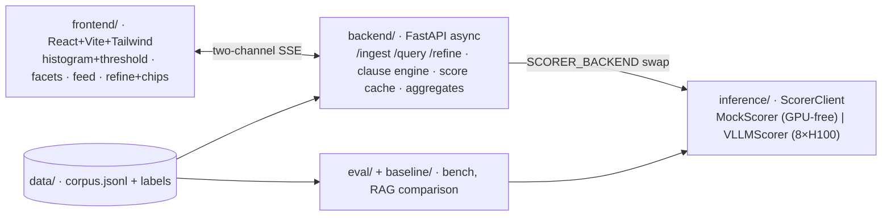

# Grep for Meaning

**An interactive semantic filter that runs natural-language queries directly over raw text — no index,
no embeddings, no schema.** Type a predicate, watch matches stream into a live dashboard, refine in
plain language, and converge in a handful of sub-second turns.

> **grep, but the predicate is meaning, and you steer it live.**

Hackathon track: **Real-Time & Interactive**. 

---

## The bet

Every retrieval stack today — RAG, GraphRAG, hybrid search, rerankers, vector DBs — exists because
inference is expensive, so engineers spend their lives curating context. **As inference gets cheap,
that whole layer collapses into one primitive:** a semantic filter that reads a raw chunk and emits a
single Yes/No token whose logprob is a continuous relevance score.

We built the live, interactive surface for that world and made it fast on 8× H100 with single-token
scoring, FP8 prefill compute, 4-bit weight/KV capacity, data-parallel replicas, warm-cache prefix
reuse, and candidate-set-scoped refinement.

Latency is the un-fakeable hero in exactly the two cases RAG can't follow:

* **Iterative refinement** — every refine turn is a fresh sub-second pass for us (cached scores), a
  full re-retrieve for RAG. Latency compounds on their side.
* **Fresh data mid-session** — drag in a new file and query it instantly; RAG must re-index first.

The felt experience *is* the pitch: **I can iterate as fast as I can think.** Refinement and
re-thresholding cost **zero new inference** — every chunk's relevance score is computed once and
cached per clause.

---

## How it works (the five mechanisms)

1. **Score = single-token logprob.** Per chunk, a constrained `Yes`/`No` token gives a continuous
   relevance score `P(Yes)/(P(Yes)+P(No)) ∈ [0,1]`. Re-thresholding re-cuts cached scores — no
   re-inference.
2. **Prompt order is load-bearing.** A stable `[instruction + chunk]` prefix (cached) + a short,
   changing `[predicate]` suffix. Refining re-prefills only the suffix per chunk.
3. **Candidate-set scoping (the primary refine mechanism).** AND/NOT score the new clause over current
   survivors only; refine cost is proportional to the scoped set, not the corpus. Needs only a cheap
   `(chunk_id, clause_id) → float` cache.
4. **Warm-on-ingest (a first-query bonus).** Pre-prefill every chunk's prefix at load so the first
   query is warm; measured against the KV budget in Phase 0.
5. **FP8 compute + 4-bit capacity + data-parallel replicas.** FP8 raises the prefill compute ceiling;
   4-bit weights/KV reduce memory pressure so the filter and warm cache fit cleanly; N single-GPU
   replicas ≈ N× throughput. (Tensor-parallel is reserved only for the stretch 32B Tier-2 model.)

---

## Architecture



* **Frontend:** React 18 + Vite 5 + Tailwind 3; virtualized results feed (`react-window`); consumes a
  single multiplexed SSE stream; the draggable histogram threshold re-cuts **cached** scores
  client-side with zero inference.
* **Backend:** FastAPI async; `/ingest /query /refine /results`; clause engine with candidate-set
  scoping; in-memory raw chunks + score cache (**no DB** — aligned with the recompute-over-store
  thesis).
* **Inference:** one `ScorerClient` interface, two implementations — a deterministic GPU-free
  `MockScorer` for local dev, and a `VLLMScorer` (6 data-parallel AWQ replicas) for the H100 box.
  Swap with one env var.
* **Eval:** `baseline/rag.py` is a standard embeddings+FAISS pipeline used **only** to time index-build
  and retrieve cost; `eval/bench.py` validates the score first, then sweeps the optimization ladders.
* **Performance:** `performance/` contains the imported closed-form compute models, benchmarking
  methodology, and figures used to turn metrics into predicted-vs-measured performance claims.

---

## Repo layout

```
inference/   vLLM serving, scoring client, prompts, warm cache          [Owner A]
backend/     FastAPI: SSE, clause engine, score cache, classifier       [Owner B]
frontend/    React dashboard: histogram, facets, feed, refine loop      [Owner C]
data/        mixed arXiv papers + code corpus, labels, predicates       [Owner D]
baseline/    RAG pipeline — EVAL ONLY                                    [Owner A/D]
eval/        ground truth, latency, scaling study, the anchor chart     [Owner A/D]
scripts/     preload_demo.sh, replay_sse.py
performance/ closed-form performance models, figures, benchmarking methodology
docs/        phase-by-phase build docs and project doc index
CONTRACTS.md the frozen seam (read this before writing any code)
PLAN.md      the full 24-hour build plan
SCHEDULE.md  phase index and milestone gates
METRICS.md   performance-oriented metrics plan
DEMO.md      the beat-by-beat demo script and runbook
RISKS.md     risk register and mitigations
```

---

## Quickstart (local, no GPU)

Development happens on a Mac with **no NVIDIA GPU** (vLLM can't install locally), so the whole stack
runs against a deterministic `MockScorer`. The 8×H100 box is the deploy/run target; switching to it is
one env var.

> Standardize local dev on a pinned **Python 3.11/3.12** venv (matches the box) and **Node 18**.

```bash
# 1) backend + mock scorer (no GPU)
python -m venv .venv && source .venv/bin/activate
pip install -r backend/requirements.txt
SCORER_BACKEND=mock uvicorn backend.main:app --reload --port 8000

# 2) frontend (in another shell)
cd frontend
npm install
VITE_DATA_MODE=live VITE_API_BASE=/api npm run dev   # proxies /api → :8000
# …or fully standalone, no backend at all:
VITE_DATA_MODE=mock npm run dev
```

Open the printed Vite URL. The app opens "live" on a seeded query so the demo starts mid-stream.

### Build the corpus (optional locally; required for real numbers)

```bash
pip install -r data/requirements.txt
python -m data.build --target mvp     # ~18k mixed arXiv abstracts + code, deterministic
```

---

## Running for real (8× H100)

```bash
# on the box (Python 3.11/3.12 + CUDA)
pip install -r inference/requirements-gpu.txt
bash inference/serve.sh                # 6 single-GPU Qwen2.5-3B-AWQ replicas, prefix caching on
                                       # writes VLLM_REPLICAS=http://localhost:8001,…,8006

# point the backend at the real scorer
SCORER_BACKEND=vllm VLLM_REPLICAS="$VLLM_REPLICAS" uvicorn backend.main:app --port 8000
```

Everything above `make_scorer()` is identical; only `SCORER_BACKEND` changes. Validate the score
before optimizing speed:

```bash
python -m eval.bench --backend vllm --gate-only      # hard-STOPs unless Tier-1 F1 ≥ 0.8
python -m eval.bench --backend vllm --tag freeze      # ladders + RAG comparison + anchor chart
```

---

## Eval

* **Score-first gate:** the harness refuses to run speed sweeps until the filter clears Tier-1
  **F1 ≥ ~0.8** on gold (arXiv topic gold + a codebase questionnaire + a BrowseComp-Plus slice).
  *Don't optimize the speed of being wrong.*
* **Performance-first metrics:** count inference work first (`chunks_scored`, cache hits, survivor
  fraction), then overlay latency and energy. See [`METRICS.md`](METRICS.md) and
  [`performance/`](performance/).
* **The money shot:** a cumulative **iteration-cost** chart — our scoped refine-loop compute vs RAG's
  per-turn re-retrieve (+ re-index on changed data) over a 6–10-turn session. The area between the
  curves is the win.
* **Optimization ladders** (config flags): refine latency B0→B3 (cold full-corpus → warm+suffix-only →
  candidate scoping → persistent cache, → ~100–300 ms/turn); throughput (batching → ×6 replicas →
  FP8 compute); capacity (4-bit weights/KV); scale (10k→20k→100k, marking the KV crossover).

Charts from the mock are stamped **PROJECTED (mock)**; the frozen run uses the real box.

---

## Demo (≈90 s)

Five core beats — stream best-first → click-NOT refine → AND refine → threshold drag → drag-in fresh
file — with word-sense recovery and the eval slide as optional closers. Every beat has a canned twin
(`scripts/replay_sse.py`, recorded from a real vLLM run) so a live hiccup degrades gracefully instead
of dying. Full script and operator runbook in `DEMO.md`.

**Degradation ladder ("never nothing on stage"):** real vLLM → `SCORER_BACKEND=mock` → canned SSE
replay → explicit op buttons → pre-staged 2nd corpus → the irreducible `ingest→query→refine→threshold`
loop on mock.

---

## Team

| Owner | Area |
|---|---|
| A | inference + warm-cache + eval + RAG baseline |
| B | backend: clause engine, aggregates, cache, classifier |
| C | frontend: dashboard, refine loop, latency readout |
| D | data/corpus + labels + demo polish (floating) |
